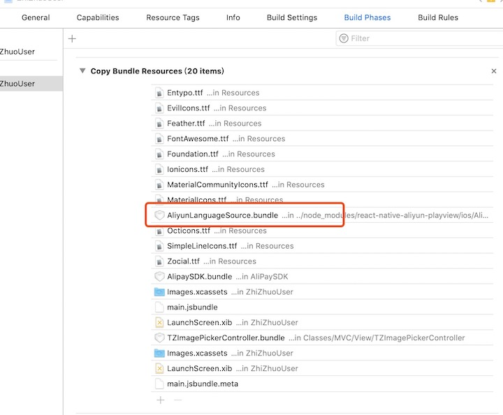
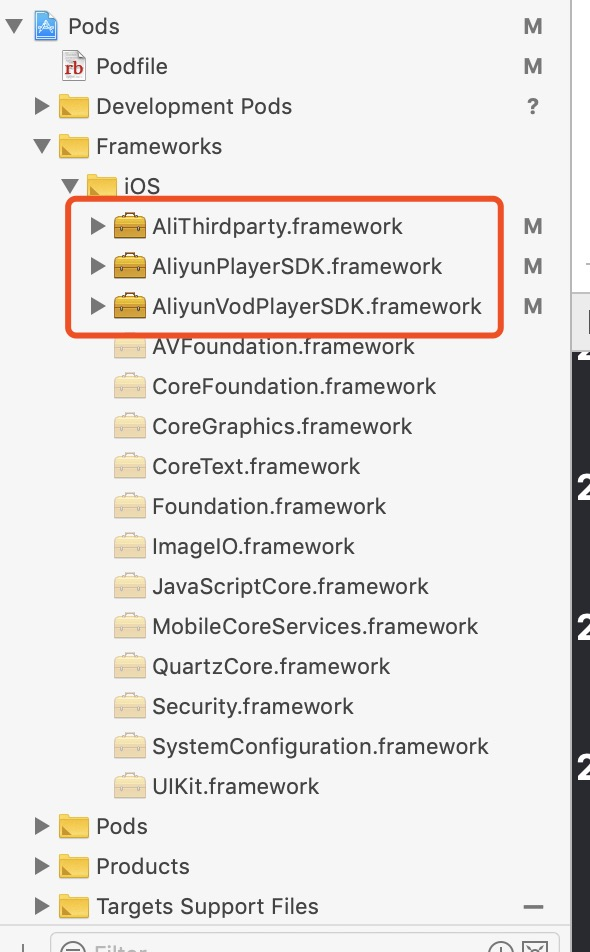

# react-native-aliyun-playview
封装阿里云视频点播播放器与短视频上传功能，支持视频播放过程中stop()、pause()、resume()、reset()、rePlay()、seekToTime()等Api调用.

### 安装方法
执行npm i react-native-aliyun-playview --save安装组件

react-native link react-native-aliyun-playview链接Android和iOS原生模块
#### Android端额外配置
在项目app build.gradle做以下配置,然后clean build运行
```java
repositories {
    mavenCentral()
    flatDir {
        dirs 'libs','../../node_modules/react-native-aliyun-playview/android/libs' //this way we can find the .aar file in libs folder
    }
}
```
#### iOS端额外配置
直接进入ios目录执行pod install然后关闭Xcode重新打开项目完成所有依赖.

          

### 视频播放使用方法
先通过接口以STS的形式返回securityToken然后打开开关showAliyunPlayView对视频组件进行渲染.
```javascript
import AliyunPlayView from 'react-native-aliyun-playview';

{showAliyunPlayView ? (
                            <AliyunPlayView
                                ref={ref => {
                                    this.videoRef = ref;
                                }}
                                style={[styles.uf1]}
                                prepareAsyncParams={{
                                    type: 'vidSts',
                                    vid: this.vid,
                                    accessKeyId: aliyunAccessKeyId,
                                    accessKeySecret: aliyunAccessKeySecret,
                                    securityToken: securityToken
                                }}
                                onPlayingCallback={data => {
                                    console.log(data.nativeEvent.currentTime, data.nativeEvent.duration);
                                    this.setState({
                                        currentTime: data.nativeEvent.currentTime,
                                        duration: data.nativeEvent.duration
                                    });
                                }}
                                onEventCallback={data => {
                                    console.log('onEventCallback', data.nativeEvent);
                                    //视频加载结束
                                    if (Number(data.nativeEvent.event) === AliYunVideoEventType.AliyunVodPlayerEventFirstFrame) {
                                        this.viewRef && this.viewRef.hideLoading();
                                    }
                                    //视频播放结束
                                    if (data.nativeEvent.event === AliYunVideoEventType.AliyunVodPlayerEventFinish) {
                                        console.log('播放结束');
                                        this.videoPlayEnd = true;
                                        this.setState({paused: true, currentTime: this.state.duration});
                                    }
                                }}
                            />
                        ) : null}
                        {paused ? (
                            <View
                                style={[styles.upa, {left: width / 2 - scaleSize(25)}, {top: videoViewHeight / 2 - scaleSize(33)}]}>
                                <CachedImage
                                    style={[w(50), h(66)]}
                                    source={require('../img/ico_video_play_one.png')}
                                    onPress={() => {
                                        if (this.videoPlayEnd) {
                                            this.videoRef && this.videoRef.rePlay();
                                            this.setState({paused: false});
                                        } else if (paused) {
                                            this.videoRef && this.videoRef.resume();
                                            this.setState({paused: false});
                                        } else {
                                            this.videoRef && this.videoRef.pause();
                                            this.setState({paused: true});
                                        }
                                        this.videoPlayEnd = false;
                                    }}
                                />
                            </View>
                        ) : null}
```
```javascript
//阿里云视频点播事件枚举状态
export enum AliYunVideoEventType {
    AliyunVodPlayerEventPrepareDone,
    AliyunVodPlayerEventPlay,
    AliyunVodPlayerEventFirstFrame,
    AliyunVodPlayerEventPause,
    AliyunVodPlayerEventStop,
    AliyunVodPlayerEventFinish,
    AliyunVodPlayerEventBeginLoading,
    AliyunVodPlayerEventEndLoading,
    AliyunVodPlayerEventSeekDone
}
```

### 短视频上传使用方法
先调用接口获取视频上传凭证,然后直接通过原生模块上传, 然后通过监听getUploadState事件捕捉上传进度
```javascript
    uploadVideoToAliYun = (type: string, videoPath: string, uploadAuth: string) => {
        if (videoPath.includes('mp4')) {
            NativeModules.AliyunRecordModule.uploadVideo({
                accessKeyId: aliyunAccessKeyId,
                accessKeySecret: aliyunAccessKeySecret,
                securityToken: uploadAuth,
                mp4Path: videoPath,
                //type用于回传，如果是三个上传任务同时异步执行，相当于jobId标记
                type: type
            });
        } else {
            Toast.message('视频上传格式出错，请重新录制');
            tagUploadVideoState(type);
        }

    };
```
```javascript
const {AliyunRecordModule} = NativeModules;
//阿里云视频点播视频上传模块
const AliyunRecordModulerEmitter = new NativeEventEmitter(AliyunRecordModule);

AliyunRecordModulerEmitter.addListener('getUploadState', (data: { code: number; message: string; vid: string; type: string }) => {
            let dataTmp = parseData(data);

            if (dataTmp.code === Api.NetworkState.SUCCESS) {
                // Toast.message('vid上传服务端' + dataTmp.type + dataTmp.vid);
                console.log('vid上传服务端', dataTmp.type, dataTmp.vid);
                this.uploadFinished(dataTmp.type, dataTmp.vid);
            } else {
                Toast.message(JSON.stringify(data));
            }
        });
```

### 视频播放效果图


相关链接短视频前后摄像头交叉续拍组件[react-native-camera-continued-shooting](https://github.com/bozaigao/react-native-camera-continued-shooting)

